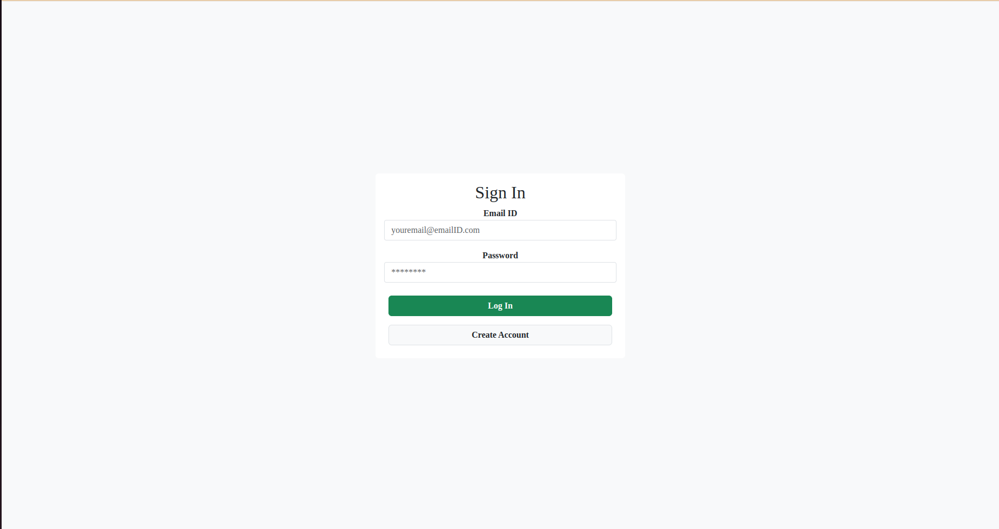
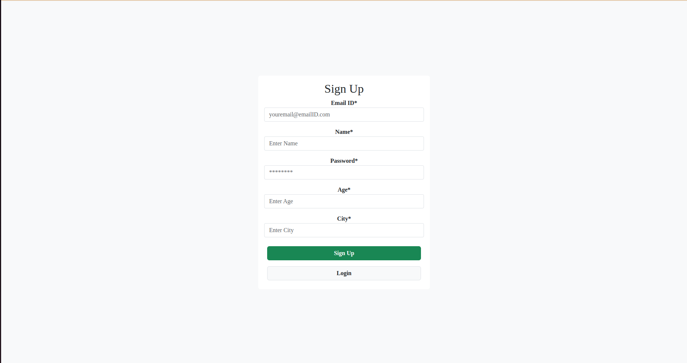
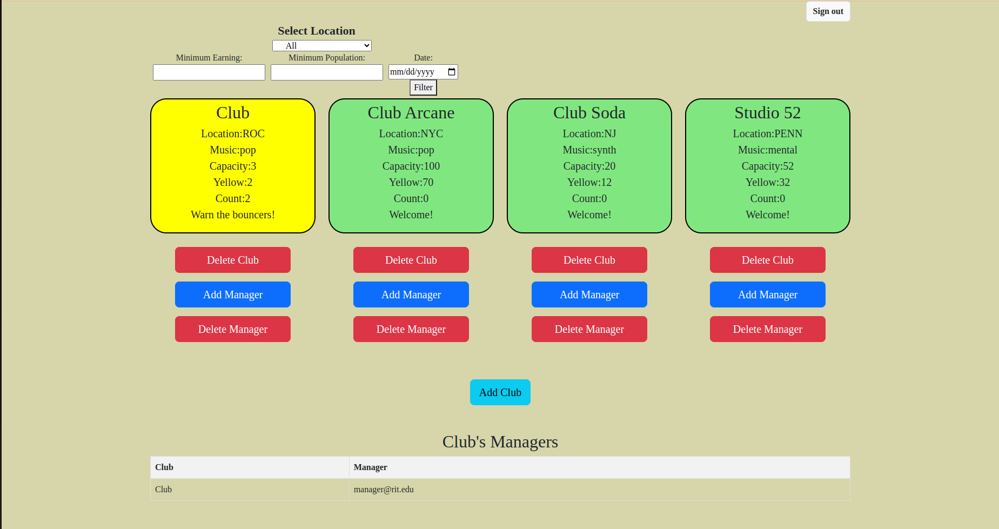
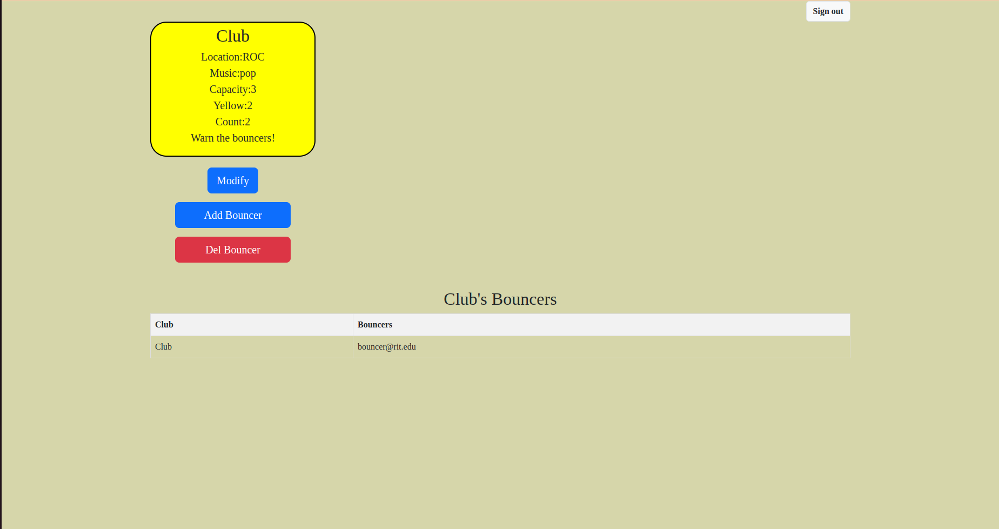
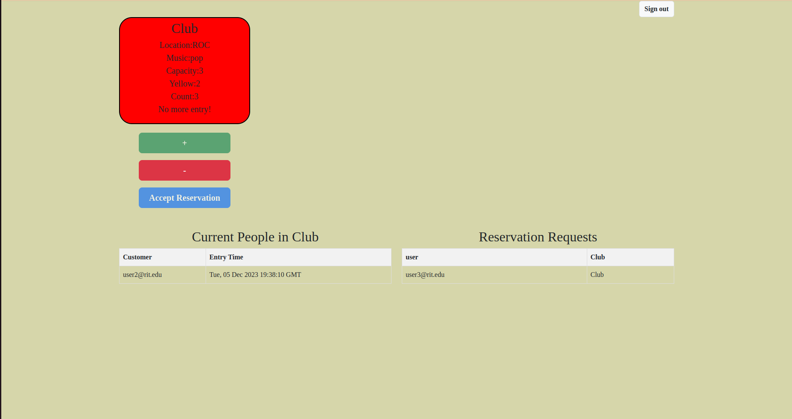
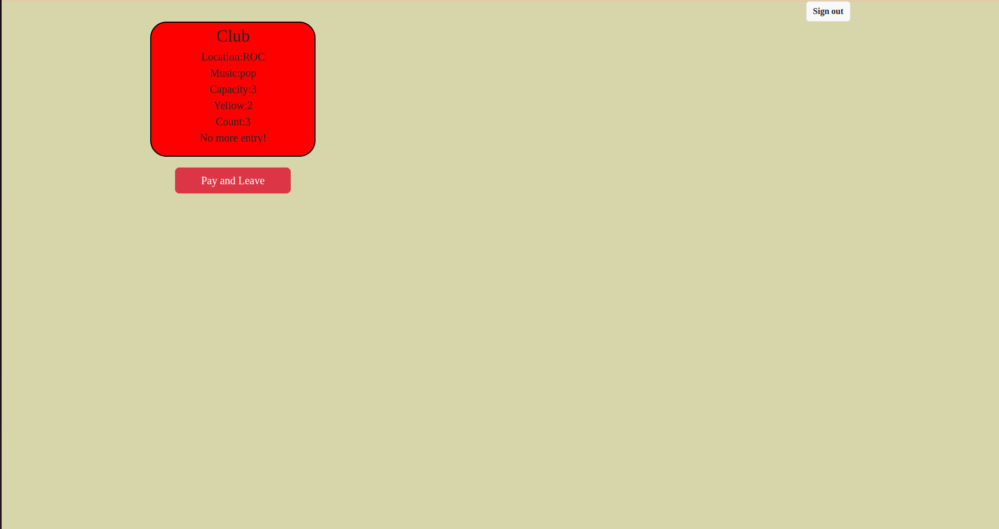
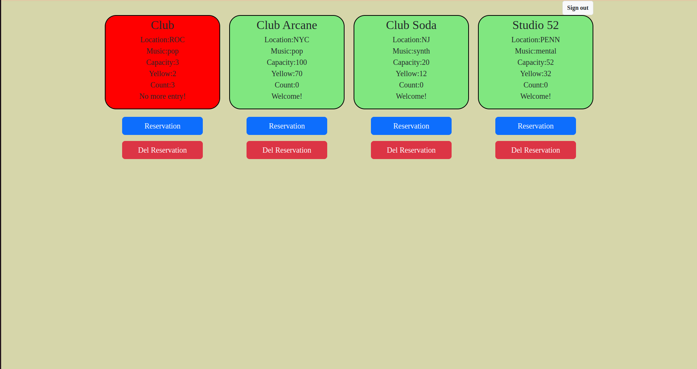

# GROUP 9: Night-Club


## Table of Contents

1. [Additional Features](#additional-features)
2. [Running Instuctions](#running-code)
3. [Unittest](#unittest)
4. [Code Coverage](#checking-coverage)
5. [Code Metrics](#code-metrics)
    1. [Cyclomatic Complexity](#cyclomatic-complexity)
    2. [Lines of Code](#lines-of-code)

6. [Application UI](#application-ui)
    1. [Login Page](#login-page)
    2. [Signup Page](#signup-page)
    3. [Admin View](#admin-view)
    4. [Manager View](#manager-view)
    5. [Bouncer View](#bouncer-view)
    6. [Cudtomer View](#customer-view)
    7. [User View](#user-view)


## Additional Features
We have added following additional features to our application
1. Login page
2. Sigup page
3. Five views based on user role 
    1. Admin View
    2. Manager View 
    3. Bouncer View 
    4. User View 
    5. Customer View 
4. User can make Reservation
5. Bouncer can accept reservation


## Running Code

To run the code clone the repository and install all the requirements in the requirements.txt file. we encourage you to create a pyhton virtual environment for this project but its not mandatory. It makes it easy to handle dependencies issue. To install all the requirements together use the command below. 
```
pip install -r requirements.txt
```

After that run the DB server using the command below. Before runnig the command make sure to change the credentials of database in config/db.yml
```
python server/server.py
```

Now to run react applicatioin open another terminal and run following comands in it
```
cd react-group-9
npm start
```


## Unittest
run unit tests by using the command below. Make sure you are in the root if directory. 
```
python -m unittest
```

## Checking Coverage

To check the coverage code run following commands in diffrent lines. 
```
python server/start_coverage.py
```

```
coverage run --parallel-mode --source=tests/ -m unittest -v
```

```
python server/stop_coverage_restapi.py
```

```
coverage combine
coverage report -m
```

## Code Metrics 
we have evaluated our code on following two metrics other than coverage. 
### Cyclomatic Complexity

To check cyclomatic complexity of the code run the following command. 

```
python3 -m radon cc server/ tests/ -a
```


### Lines of Code

To check cyclomatic complexity of the code run the following command. 

```
python3 -m radon raw server/ tests/
```


## Application UI
The GUI of the application consists of following pages

### Login Page
- The login page is used by all the users (irrespective of their role) to login and use the application. 
- The login page redirect the logged in user to other pages according to its role. 
- The login Page also send the **Session ID** of the logged in user to other pages which they use for authenticatiion while performing any operation on database. 
- The login page also has a button to redirect to signup page.



### Signup Page
The signup page makes it possible for new users to create an account and use application. 



### Admin View
The admin has the authority to do the following operations. 
- Add/delete club
- Add/delete Manager
    - A dropdown list shows all the users that can be added as manager. Users who are already manager of other clubs dont show in the drop down. 
- Filter the clubs
    - Admin can filter the clubs base of location, earning, and population. Admin can also set date in the filter to consider only records on that day. 
- sign out

Some of the restrictions on the operatiions performed by admin are as follows.
- cannot add a two clubs with same name
- one club has only one manager
- one manager can manages only one club 

The list of all the managers in also provided at the end of the page. Whenever admin makes a cahnge, the list is also updated.  




### Manager View

The manager has authority to do following operation. 
- add/delete bouncer
    - A dropdown list shows all the user which are not manager or bouncer already
- modify club information 
- sign out

Some of the restrictions on the operatiions performed by manager are as follows.
- cannot make the name of the club similar to any other other
- one club can have multiple bouncers
- one bouncer can have only one club 

The list of all the bouncer in also provided at the end of the page. Whenever manager makes a cahnge, the list is also updated.  





### Bouncer View

The bouncer has authority to do following operation. 
- add/remove customer
    - A dropdown list shows all the user which are not manager or bouncer or present in anyother club.
- Accept Reservation
    - A dropdown list shows the reservation request from the users for current date. 
- sign out

Some of the restrictions on the operatiions performed by manager are as follows.
- cannot add more people than the capacity of club


The list of all the customers in the club in also provided at the end of the page. Whenever bouncer makes a cahnge, the list is also updated. Moreover, a list of all the reservation requests is also provided. When bouncer approves the request, the item moves from reservation list to customers list.   



### Customer VIew
The customer has authority to do following operation. 
- leave the club
- sign out



### User View
The user has authority to do following operation. 
- add/del reservation

Some of the restrictions on the operatiions performed by manager are as follows.
- cannot add multiple reservavtions for the same date. 


