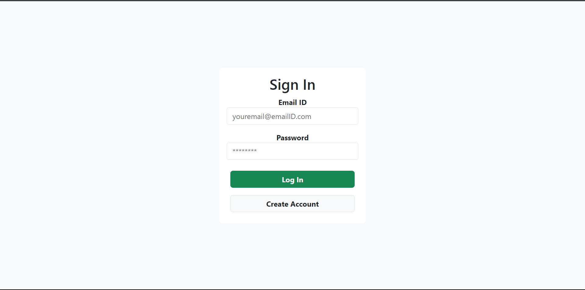
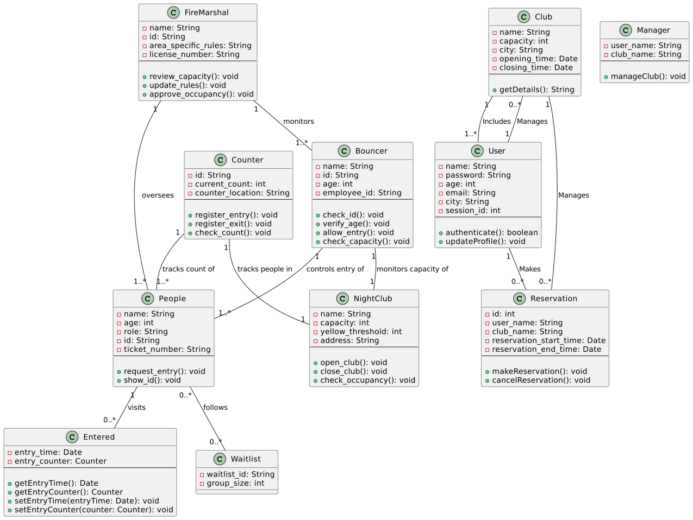

# Design Document

## 1. Considerations

#### 1.1 Purpose
The purpose of this product is to track the number of people in a club in real-time. The product assumes that each club has predefiend maximum capacity. Each club alo has bouncers and managers. The bouncers are responsible to allow people enter in the club. They do so while keeping an eye on the counter. If the club reaches its maximum capacity, bouncers dont allow people to enter in the club. The manager of the club is responsible for appointing bouncers and updating club related information like name, area, capacity, opening and closing time, etc. The product employs access control to provide different users with different functionalities. Moreover, the product is simultaneously used by multiple branches of the club in different cities, therefore, it is necessary to keep the data of different clubs seperately. The core goals are maintaining accurate real-time occupancy counts, preventing overcrowding, and keeping staff informed. Flexibility is needed to handle edge cases and exceptions.

#### 1.2 Constraints
1. **Near real-time tracking required**
       
   The system needs to track club capacity and occupancy close to real-time. As people enter and leave the club, the count should be updated within seconds to accurately reflect the current numbers inside. This is important for identifying when capacity is reached and to keep waitlists updated.

2. **High accuracy needed for safety**
   
   The occupancy numbers need to be highly accurate to maintain safety. Even small errors in the counted occupancy could result in overcrowding and unsafe conditions if more patrons are allowed to enter than legally permitted. Accuracy within +/- 5 people is recommended.

3. **Must integrate with access control systems**

   To automatically track entries and exits, the system should integrate with access control systems like RFID readers or badge scanners installed at club entrances. This allows automatic counting as people enter and leave rather than relying on manual counts.

4. **Needs to handle high volume traffic**

   Clubs can see thousands of patrons on busy nights. The systems needs to handle these high volumes of traffic and occupancy counts without crashing or degrading in performance. Speed and stability with large numbers are critical.*

5. **Fast user response times essential**
    
    The system needs to provide fast response times to user actions like updating counts or occupancy. Bouncers and managers need real-time data to make decisions on allowing club entry. Delays of more than a few seconds are unacceptable. Optimization for speed is key.

## 2. Requirements
1. **Monitor nightclub capacity**
     a. The system needs awareness of the club's legal capacity set by fire codes and regulations.
     b. It must track current occupancy numbers in real-time by counting entries and exits.
     c. Current headcount should be compared against the legal capacity to identify available space.

2. **Control entry to remain within capacity**
    a. Bouncers must be able to control entry to prevent exceeding capacity limits.
    b. The system should provide real-time occupancy counts to bouncers.
    c. When capacity is approached, bouncers are alerted to restrict entry.

3. **Track number of people entering and occupying**
    a. All club entry points must be tracked to count patrons entering and leaving.
    b. Some approaches include turnstiles, RFID sensors, WiFi signal sensing, video analysis, etc.
    c. Based on entry/exit counts, calculate current occupancy

4. **Alert at threshold occupancy**
    a. As capacity limit is approached, alerts should be generated at threshold intervals (e.g. 95%, 100%).
    b. Bouncers and managers should be informed to control entry flow.
    c. At 100% capacity, bouncers must block further entry.

## 3. MVP Featurese
Following features should be present in Minimum Viable Product(MVP) 

1. Filter club based on poplution or income 
2. Get club's population and income for lifetime.
3. Get club's population and income for given evening.
4. Keep track of count of people in the club. 

## 4. Additional Features
Following are the additional features offered to enhance the usability of product
1. Reservation: Customers will be able to resrve place in advance, subject to the approval by manager.
2. Waitlist: In case club has reached its capacity, user can opt to enter waitlist. 

## 5. Sub-System :
The Product consists of following subsystems. 

#### 5.1 Users :
All the people related to the club (customers, managers, bouncers) are reference by an umbrella term USER. This allows full management of user accounts - creating, reading, updating, deleting
This subsystem provides user with following functionality.
            
1. GET - Returns info for all users or a specific user
2. POST - Creates a new user account
3. PUT - Updates info for an existing user  
4. DELETE - Deletes a user account 

&nbsp;

&nbsp;

#### 5.2 Login :

This subsystem handles all functionality related to user login. It Provides an endpoint for users to login. It checks the username and password against the database. If valid, it generates a new session ID and returns it.

&nbsp;

&nbsp;

&nbsp;

&nbsp;

&nbsp;

#### 5.3 Managers:

This subsystem deals with managing nightclubs. It lets you create, update, and delete club related information. The product assumes that adimin add manager for each Club. This subsystem provide following functionality. 

1. GET - Return all the managers
2. POST - assign one of the users as a manager of the club
3. PUT - Update the manager of the club
4. DELETE - Remove the manager of the club

#### 5.3 Bouncers:

This subsystem deals with controlling capacity of nightclubs. The manager of the club add bouncers to the club. This subsystem provide following functionality. 

1. GET - return all the bouncers
2. POST - manager can add bouncer to the club
4. DELETE - Manager can remove bouncer from the club

#### 5.4 Clubs:

This subsystem provides CRUD operations for clubs:
1. GET - Get all clubs
2. POST - create a new club
3. PUT - manager can modify information of the club
4. DELETE - manager can delete the club

Together this enables full lifecycle management of clubs - creation, modification, manager/bouncer assignment, deletion.

#### 5.5 Entry:

This subsystem enable bouncers to allow people to enter in the club if there is space. 
1. POST - Allow people to enter the club if capacity of the club permits. IT checks there are no multiple entries for the same user. 
2. PUT - Allow bouncers to record leaving time anda amount spent by each customer. 

#### 5.6 Club Information:

This subsystem enables to get information about population and income of the club. It can give acumulated population/income and also for a single specified day. 

&nbsp;

&nbsp;

&nbsp;

#### 5,7 Capacity Tracking :

This subsystem tracks club capacity and occupancy. It handles entries, waitlists, and reservations. This supports tracking current occupancy against capacity and managing overflow via waitlists and reservations. The classes are:

1. Entered - Logs entries into a club. Tracks who has entered.
2. WaitList - Manages a waitlist for a club. Patrons can join the waitlist if the club is full.
3. Reservation - Allows reserving spots at a club in advance.

Together this enables full lifecycle management of clubs - creation, modification, manager/bouncer assignment, deletion.

#### 5.8 Database :

The database subsystem handles initializing and interacting with the database. This subsystem abstracts away the database implementation behind a simple utils API.
1. Init - Sets up the initial database schema defined in SQL scripts.
2. DB Utils - Provides reusable functions for executing SQL queries and transactions. Used by other classes to interact with the database.

#### 5.9 API :
Exposes the overall nightclub management functionality via a REST API. This enables other services to integrate with the nightclub management platform via REST APIs.

1. App - Creates the Flask app instance that will handle requests.
2. Api - Configures the API routes. Maps HTTP methods and endpoints to handler functions from the other subsystems.

## 6. Domain Model :

## 8. UML

### 8.1 Class Diagram :

&nbsp;&nbsp;&nbsp;&nbsp;

The above given diagram explains the various describes the various classes and functions involved in the nightclub management system. The user class handles the user details needed for login. The user class also contains the authentication function and function to update profile details. Each user can make a reservation at the club. The reservation class helps the user to create a reservation and cancel it. The system additionally provides the manager class that helps regulate and manage the club. The bouncer class monitors the capacity of the nightclub. It also verifies the people who enter the nightclub, and then allows the people to enter the nightclub.

### 8.2 Domain Model :

[domain model Diagram](pictures/domainmodel.png)

The diagram shows the key entities involved in monitoring and controlling nightclub capacity. It uses UML class diagram notation to visualize the classes and relationships.
At the top level, there is a FireMarshal class that oversees the capacity management. It has attributes like name, ID, and area-specific rules.
The FireMarshal monitors Bouncers, who control entry of People into the NightClub. Bouncers have attributes like name, age, and ID. They have an association to People for controlling entry.
People who want to enter the club are modeled as a class with attributes like name, age, role, and ID. People visit the club and get counted.
The NightClub itself has a name, capacity limit, and yellow threshold level. The capacity is monitored by the Bouncers.
There is also a Counter class that tracks the count of People entering and occupying the NightClub. It records the current count.
Additionally, there are Entered and Waitlist classes that relate to People visiting the club or waiting to enter.
Overall, the classes model the essential entities like people, bouncers, and fire marshals along with relationships like monitoring, controlling entry, and counting occupants. This provides a conceptual model for the nightclub capacity management domain.
Once a customer is allowed to enter, the entered class then allows us to track the entry time of the customer. In case the nightclub is filled, the customers are put onto a waitlist which is handled by the 'Waitlist' class. The counter class is used to record the time of the entry of the customers and also the exit time of the customers. It also maintains a count of the people at the nightclub at any point in time. The FireMarshal class oversees the safety of the nightclub, It reviews and then approves the capacity of the club. The FireMarshal sets the rules and also updates the rules.

## 8.1 Class Diagram :

